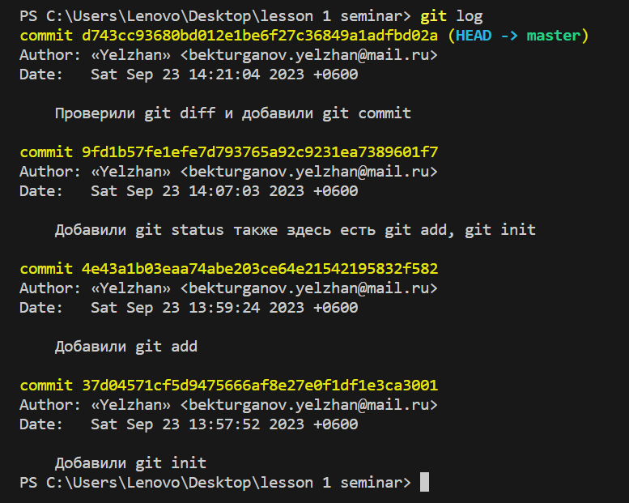

# Основные комнды Git

**git init - инициализация локального репозитория.**

*git add - отслеживание изменения файла*

*git status - получить информацию от Git, о его текущем состоянии*

*git commit -m “message” – создание коммита*

***git log – вывод на экран истории всех коммитов с их хеш-кодами***

**git checkout:** 
1. git checkout – переход от одного коммита к другому
2. git checkout master – вернуться к актуальному состоянию и продолжить работу

**git diff – увидеть разницу между текущим файлом и закоммиченным файлом**

> git branch – посмотреть список веток в репозитории
> git log --graph - показ древа
> git log --oneline - коротенький журнал
